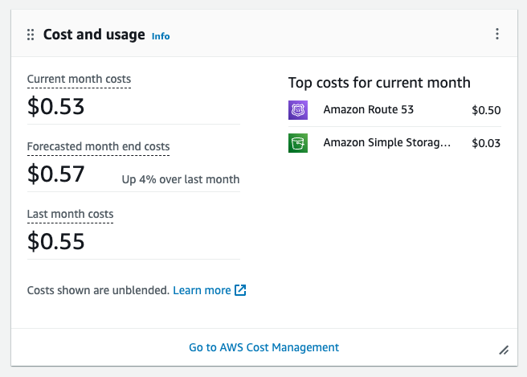

## This is my portfolio at [cksau.com](https://cksau.com)

##Overview:

- Pinterest style website built using HTML, CSS, and  JavaScript.
- Python used to automate image paths and naming.

##Architecture:

- Hosted on AWS S3 bucket.
    -No server or database for a lightweight and cost-effective setup.
- Domain managed by Route53.
- Content Delivery Network (CDN) powered by ElasticCache.

Cost-efficient setup with a monthly cost of only $0.50.
Utilizes ElasticCache for enhanced performance, maintaining a quick site experience.

